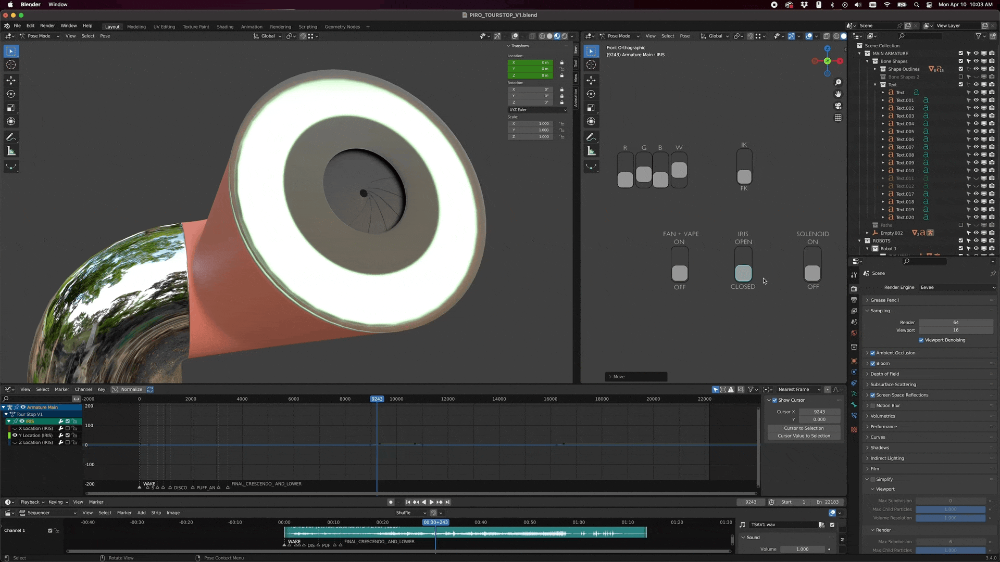
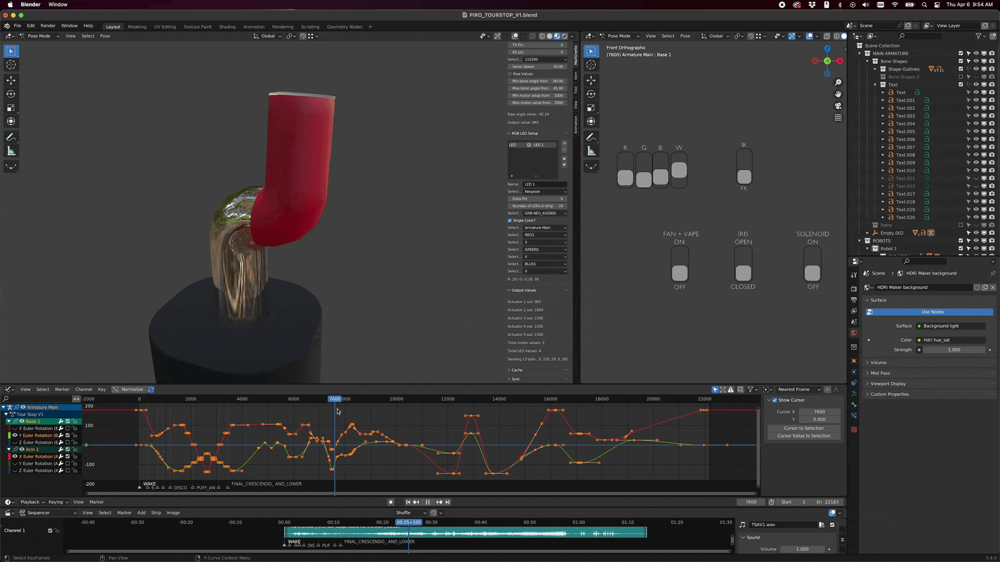
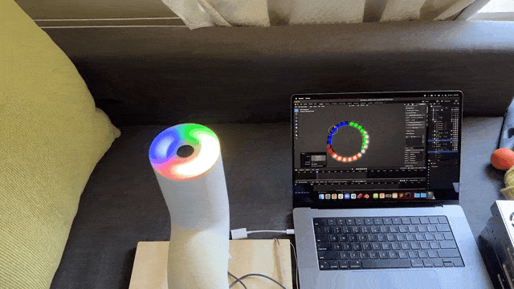

	
	

MarIOnette is a Blender plugin for controlling Arduino-based microcontrollers over Serial

[See it in action here](https://www.youtube.com/watch?v=sCcKe_KH84M)

MarIOnette has been tested on most AVR-Based Arduino-compatible microcontrollers. ARM-Based Teensy microcontrollers have also been verified. Other microcontrollers have not yet been tested.

### A few examples and templates have been prepared to get you up and running (see the Examples folder)
[Post-it Drawing Robot](https://www.youtube.com/watch?v=nJkThBeOZog)

A more general video describing the interface, mixing motors + LEDs, and gotchas is coming soon!

### Requirements
- Blender 3.2 or above
- Arduino 2.0 (Earlier versions have also been tested to work)
    - Install the following libraries for Arduino:
        - AccelStepper
        -  PWMServo
        -  Adaftui_Neopixel

### Installation on Mac
1. Download the Marionette.zip file from the Blender Plugin folder
2. Open Blender
3. Go to edit > preferences
4. Select "Add Ons"
5. Click on "Install" in the upper right
6. A browser should pop up. Navigate to the .zip file you downloaded and select it
7. Click on the check box next to the add-on to enable it
8. To view MarIOnette, press 'N' to bring up the side bar

### Installation on Windows
1. Download the Marionette.zip file from the Blender Plugin folder
2. (IMPORTANT) Open Blender as Administrator
3. Go to edit > preferences
4. Select "Add Ons"
5. Click on "Install" in the upper right
6. A browser should pop up. Navigate to the .zip file you downloaded and select it
7. Click on the check box next to the add-on to enable it
8. To view MarIOnette, press 'N' to bring up the side bar

### Setup
1. Add actuators inside the actuator panel
2. Add leds inside the LEDs panel
3. Make sure you select all the correct pins as they are attached to your microcontroller
4. In the sync panel, name your project and select a save directory
5. Hit "Sync"
6. Open your file browser and navigate to the project you just created
7. Open the MarIOnette_Template_V1.ino file; Arduino should launch
8. Plug in your microcontroller
9. Specify your board and serial port
10. Hit "Upload"
11. Back inside Blender, Enable Serial in the MarIOnette Serial panel
12. Refresh the serial ports and select the desired port
13. Press "Connect"
14. Go through your actuators and adjust the mapping values until the viewport matches what's on your desk
    - For bones: 
       1. Move the bone to the minimum angle value (-90 by default)
       2. Change the minimum mapped value (1000 by default) until you have a match
       3. Move the bone to the maximum angle value (90 by default)
       4. Change the maximum mapped value (2000 by default) until you have a match
       5. Repeat for all actuators

### IMPORTANT
For MarIOnette to send values to the microcontroller, you must keep the MarIOnette tab open and visible in your Blender viewport

### MarIOnette currently supports the following actuators:
Servos

PWM

ON/OFF (Solenoid)

Dynamixels and Bus Servos

### And LEDs:
Neopixels

Support for more actuators coming soon...

Have Fun!
